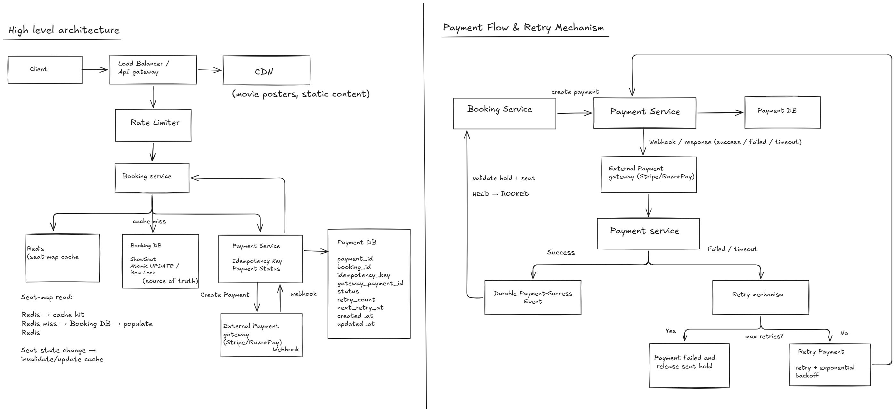

# Design a Movie ticket Booking System

Design a **movie ticket booking system**. Users should be able to discover a movie, select a theatre/show, view available seats, and book seats.

## 1. Clarifying Questions
1. How many booking requests/Peak traffic?
2. Should users be able to retry failed booking/payment requests, and should retries be safe?
3. Do we build Payment?
4. Do we support booking cancellation? What are the refund/cancellation rules?
5. Single country/time-zone or global?
6. Do we need to hold the seats temporarily? If yes, how long?

## Assumptions
- System is for multi-city within single country.
- Seats are temporarily held during checkout and expires after 5 minutes.
- Users can cancel the confirmed booking according to the booking cancellation policy.
- Payment is in scope, but the payment gateway is external system like Stripe/RazorPay.

### 1.1. Functional Requirements
- Users should be able to search for shows/movies.
- Users can select the venue, date, time and event/movie and book the seats.
- Users should be able to view the available seats.
- Users can temporarily hold the selected seats for a short checkout window.
- Users can pay and recieve the booking confirmation.
- Payment transaction should be idempotent
- System should prevent double booking when multiple users attempt to book the same seat concurrently.
- Users receive booking-related notifications.
- Users can cancel the confirmed booking according to the booking cancellation policy.

### 1.2 Non - Functional Requirements
- High availability and durability
- Low read latency
- Strong consistency for seat allocation/booking.
- System should handle sudden traffic spikes during popular show releases.
- Error handling and safe retries.

## 2. Scale Estimation

### 2.1 Scale Assumptions
- Total users: **10 millions** 
- Successful bookings: **100K/ day**
- DAU: **2 millions**
- Avg request per DAU: **10 request/day**
- Peak traffic multiplier: **10x average traffic**
- Each booking record: **1KB**
- Each payment record is ~**1 KB**

---

### 2.2 Request Volume
#### Total request 
```text
DAU × Average requests per user
2M * 10 = 20M request/day
```
#### Average QPS
```text
20000000/86400 = 231.481  ~ 230 QPS
```
#### Peak traffic
```text
230*10= 2300 QPS
```
**Peak overall traffic ≈ 2,300 QPS**

### 2.3 Write / Booking Volume
#### Average successful booking 
```text
100000/86400 ~ 1.2 QPS
```
#### Peak Booking traffic 
```text
1.2 * 10 = 12 QPS
```
**Peak booking traffic ≈ 12 QPS**

This tells us the **system is read-heavy**.
**CDN can absorb high-volume requests for static movie/theatre images and reduce origin traffic.**

### 2.4 Storage estimation
#### Booking storage 
```text
100K*1KB = 100000 * 1000 = 100 MB/day
```
#### Payment storage
```text
100K*1KB = 100MB/day
```

#### Total storage per day
```text
200MB/day booking + payment data
```
### Yearly storage
```text
200MB * 365 = 73 GB/year
```
## 3. API Design 

#### 3.1 Search/ Fetch movie shows API

**Request:**
**GET**`/movies?movieName=Avatar&city=Bengaluru`

**Response:**
```json
{
    "theatres": [
        {
            "theatreID": "P123",
            "theatreName": "PVR Orion",
            "shows": [
                {
                    "showID": "P456", 
                    "startTime": "10:00"

                },
                {
                    "showID": "P123", 
                    "startTime": "14:00"
                }
            ]
        },
        {
            "theatreID": "I123",
            "theatreName": "INOX Forum",
            "shows": [
                {
                    "showID": "I456", 
                    "startTime": "10:30"

                },
                {
                    "showID": "I123", 
                    "startTime": "19:00"
                }
            ]
        }
    ]
}
```

#### 3.2 View shows and seat API
**Request:**
**GET**`/shows/{showID}/seats`

**Response:**
```json
{
    "showId":"P456",
    "seats": [
        {
            "seatId": "A1",
            "price": 280,
            "status": "AVAILABLE"
        },
        {
            "seatId": "F9",
            "price": 180,
            "status": "BOOKED"
        },
        {
            "seatId": "B6",
            "price": 280,
            "status": "HOLD"
        }
    ]
}
```

#### 3.3 Hold Seats API

**Request:**
**POST**`/shows/{showID}/seat/hold`

```json
{
    "seatIds": ["A1","A2","A3"],
    "status": "HOLD",
    "userId": "U123",
    "holdId": "H23",
    "expiresAt": "2026-09-13T16:15:00"
}
```
**Success Response:**
HTTP 200 OK
```json
{
    "holdId": "H23",
    "status": "HOLD",
    "seatIds":  ["A1","A2","A3"],
    "expiresAt": "2026-09-13T16:15:00"
}
```

**Conflict  Response:**
HTTP 409 CONFLICT
```json
{
    "message": "One or more seats are unavailable",
    "unavailable_seats":["A2"]
}
```

#### 3.4 — Payment API

**POST**`/holds/{holdId}/pay`

**Request:**
```json
{
    "holdID":"H23"
}

```

**Response:**
```json
{
    "total_amount": 840,
    "payment_status": "PENDING",
    "paymentID": "P97321",
}

```

#### 3.5 Payment Webhook API
**POST**`/payments/{paymentID}/webhook`

**Request:**
```json
{   
    "eventID": "E123",
    "payment_type":"CARD",
    "payment_status": "SUCCESS" 
}

```

**Response:**
HTTP 200 OK
```json
{
    "message": "Webhook processed"
}
```

#### 3.6 Get Booking API
**GET**`/bookings/{bookingId}`

**Response**
```json
{
    "bookingId": "B123",
    "movie":"Avatar",
    "theatre": "PVR Orion",
    "show": {
        "showId": "P456",
        "startTime": "10:00"
    },
    "seatIds": ["A1","A2","A3"],
    "amount": 840,
    "status": "BOOKED"
}
```

#### 3.7 — Cancel Booking API
**POST**`/bookings/{bookingId}/cancel`

**Request**
```json
{
    "reason":"change of plan"
}
```
**SUCCESS Response:**

**HTTP 200 OK**
```json
{
    "bookingId": "B123",
    "status": "CANCELLED",
    "cancellation_charge": 120,
    "refund_amount": 720
}
```

**FAILED Response:**

**HTTP 409 Conflict**
```json
{
    "bookingId": "B123",
    "message": "Booking cannot be cancelled",
    "reason": "Cancellation window has expired"
}
```

## 4. Data modelling
Movie
    - movieName
    - movieId

Theatre
    - theatreId
    - city 

Screen
    - screenId
    - theatreId

Seat 
    - seatId
    - price

Show
    - showId
    - movieId
    - screenId
    - startTime
    - endTime

ShowSeat
A (showId, seatId) combination can have at most one active ShowSeat record.
Concurrent seat booking is protected using DB transaction + row-level locking / conditional update. 

    - showId
    - seatId
    - holdId
    - expiresAt
    - showId+seatId → UNIQUE (concurrency/double-booking)
    - status
    
Payment
    - paymentId
    - payment_status
    - holdId
    - amount
    - idempotency_key
    - providerTransactionId

Booking
    - bookingId
    - userId
    - showId
    - total_amount
    - booking_status
    - createdAt

## 5. High level architecture

### Architecture Diagram



## 6. Deep Dives

### 6.1 Concurrency/ Seat confirmation
- Multiple users can attempt to book the same seat concurrently.
- Seat allocation must be atomic and use row-level locking or atomic conditional updates.
- Before `HELD -> BOOKED`, Booking Service validates that:
  - payment succeeded
  - hold is still valid
  - seat still belongs to that hold
- Only one user should be able to book a seat, ohters receive '409 Conflict'. 
- Payment webhooks can be retried, so webhook processing should be idempotent using the provider's event ID.
- Booking confirmation should also be idempotent.
- The database lock is short-lived; the business seat HOLD lasts for 5 minutes.

### 6.2 Seat Hold Expiry
- Seats are temporirarily held for about 5 minutes.
- `expiresAt` is the source of truth for whetehr a hold is valid or not
- We will use  **lazy expiry** instead of updating every expired hold.
- If `status == HELD` and `expiresAt < currentTime`, the effective seat status is treated as `AVAILABLE`.
- The DB row can remain `HELD` until a subsequent operation lazily updates/reclaims the seat.
- `GET /shows/{showId}/seats` calculates the effective seat status before returning it.
- When a user actually tries to acquire an expired seat, the system atomically transitions it to a new `HELD` state using the concurrency mechanism from 6.1.
- This avoids continuously scanning/updating expired holds with background workers. 

### 6.3 Payment ↔ Booking consistency
- Payment and booking service are separate services, so the external payment gateway and our DB cannot be an atomic transaction.
- After receiving and persisting a successful payment webhook, the Payment Service publishes a durable payment-success event.
- Booking service validates:
    - the seat is held by the same user.
    - hold is still valid
    - payment is successful
- If the validation is succesful, then `HELD`-> `BOOKED`.
- If the hold as expired, then don't book the seat, initiate refund and notify the user.
- Payment-success events can be retried, so processing must be idempotent using the provider event ID.
- Booking confirmation should also be idempotent to prevent duplicate bookings.

### 6.4 Handling High Traffic for Popular Shows
- Seat-map requests are read-heavy, so redis can cache frequently accessed seat maps and reduce repeated DB reads
- Redis is used for fast reads; but however for seat allocation we depend on the authoritative DB because strong consistency is required.
-  When seat state changes, the relevant cache entry should be updated or invalidated.
- A short cache TTL provides a fallback against stale data.
- **Cache stampede protection/request coalescing** prevents thousands of simultaneous cache misses from hitting the DB.
- **Rate limiting/admission control** protects the Booking Service and DB from sudden traffic spikes.
- Rate limiting does not prevent double booking; DB-level atomic seat allocation remains responsible for correctness.

## 7. Bottleneck and Trade - Offs

### 7.1 Booking Service bottleneck
- During popular movie releases, many users may send requests simultaneously.
- A single Booking Service instance can become overloaded.
- Use **horizontal scaling** behind a Load Balancer to distribute traffic across multiple instances.

### 7.2 Database read bottleneck
- The system is **read-heavy**, especially for movie/show and seat-map queries.
- Use **Redis to cache frequently** accessed read data, such as seat maps and show/movie metadata.
- Use **read replicas** for scalable non-critical reads.
- The **primary DB** remains the source of truth for **seat allocation.**

### 7.3 Database write bottleneck
- Seat holds/bookings require writes to the primary DB because **strong consistency** is required.
- At the current scale, a **single primary DB** is sufficient.
- If write volume grows significantly, **partition/shard **the data, while being careful about hot partitions for popular shows.

### 7.4 External payment gateway dependency
- The external payment gateway can have high latency, timeouts, or temporary failures.
- Use **timeouts and exponential backoff** with bounded retries.
- Payment operations must remain idempotent so retries don't create duplicate payments.

### 7.5 Traffic spikes
- During popular movie releases, sudden bursts of requests can overload the Booking Service and DB.
- Use r**ate limiting/admission control** to protect downstream services.
- Rate limiting protects system capacity; DB-level atomic updates still prevent double booking.

### 7.6 Redis failure
- If Redis becomes unavailable, seat-map reads can fall back to the DB.
- This increases DB load and latency, but does not affect booking correctness because Redis is not the source of truth.

### 7.7 Static content bottleneck
- Movie posters, thumbnails and other static content can generate high read traffic.
- Use a **CDN to cache static content** and reduce load and latency at the origin.

## 8. Reliability

### 8.1 Load Balancer Failure
- Load balancing layer should be **highly available with health checks and failover**.
- If one load balancer instance fails, traffic should be routed through a healthy instance.

### 8.2 Booking Service Failure
- Booking Service should be **stateless and horizontally scaled**.
- If one instance fails, the Load Balancer routes requests to healthy instances.
- Failed instances are brought back after health checks succeed.

### 8.3 Redis Failure
- Redis is used only as a **cache** and is not the source of truth.
- If Redis fails, reads **fall back** to the Booking DB.
- This may increase latency and DB load, but booking correctness is not affected.

### 8.4 Payment Gateway Failure
- External payment gateway can timeout or temporarily fail.
- Use **request timeouts, exponential backoff and bounded retries**.
- Payment requests use an idempotency key so retries do not create duplicate payments.
- After maximum retries, mark the payment as failed, release the seat hold and notify the user.

### 8.5 Payment DB Failure
- Payment DB should use **replication/high availability** and backups.
- If the primary fails, failover to a healthy replica.
- Avoid using Redis as the source of truth for payment state.

### 8.6 Payment Success but Booking Service Failure
- Payment success should produce a **durable payment-success event**.
- If Booking Service is temporarily unavailable, the event remains available for processing.
- When Booking Service recovers, it processes the event and validates the hold/seat before confirming the booking.

### 8.7 Payment Succeeds After Seat Hold Expiry
- Booking Service validates the hold before confirming the booking.
- If the hold has expired, the seat must not be booked.
- The successful payment should be refunded.

### 8.8 Duplicate Payment Webhook
- Payment webhooks may be delivered multiple times.
- Use the provider's event ID for idempotent webhook processing.
- If the event ID has already been processed, return the existing result and do not process it again.

### 8.9 Seat Booking Concurrency
- Seat allocation uses an **atomic conditional update or row-level locking**.
- Only one user can transition a seat from AVAILABLE → HELD.
- Concurrent attempts for the same seat receive 409 Conflict.

### 8.10 CDN Failure
- If the CDN is unavailable, static content can fall back to the origin.
- This may increase latency, but it should not affect booking or payment correctness.

## 9. Observabilty

### Metrics
- Booking Service:
  - Request rate (QPS)
  - Latency
  - Error rate
  - 4xx / 5xx rate
- Database:
  - Query latency
  - Connection pool usage
  - CPU / memory
  - Error rate
- Redis:
  - Hit/miss ratio
  - Latency and Error rate
- Payment:
  - Payment success/failure rate
  - Gateway timeout rate
  - Payment latency
  - Retry count
- Booking:
  - Booking confirmation rate
  - Hold → Booked conversion rate
  - Hold expiry rate
  - Seat booking conflicts / 409 rate

### Logs
- Structured logs with:
  - requestId
  - userId
  - showId
  - seatId
  - holdId
  - bookingId
  - paymentId
  - eventId
  - status/error
- Never log sensitive payment/card information.

### Alerts
Alert on:
- Sudden increase in 5xx errors
- High DB/Redis latency
- High DB connection usage
- Redis failure/high cache-miss rate
- Payment gateway failure/timeout spike
- Unusual payment retry rate
- Drop in booking confirmation rate
- Increase in seat-booking conflicts