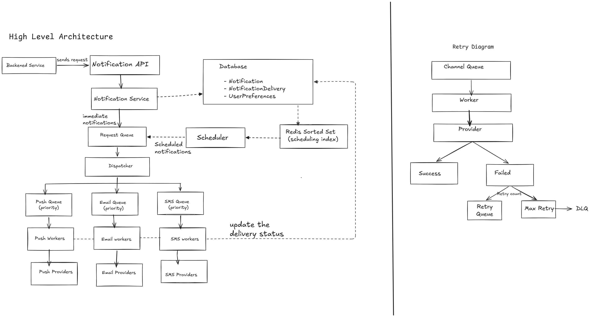

# Design a Notification System

Build a system that allows different backend services to send notifications to users.
A notification could be delivered through:

- Push notification
- Email
- SMS

The system should support potentially millions of users and large bursts of notifications.

## 1. Clarification Questions 
- how many notifications request?
- is it atleast once delivery, at-most-once, or exactly-once??
- who calls the notification system? end users or backend services? 
- Per channel delivery or multiple channel?
- Does user has any preferences?
- Do we need to support scheduled notifications or immediate one?

### Assumptions
- Backend services are the clients.
- Supports Push, Email and SMS
- Notification can use multiple channels
- We choose at-least-once delivery.
- System should handle millions of users.
- Failed deliveries should be retried
- We support both immediate and scheduled notifications.

### 1.1 Functional Requirements
- backend services can request a notification for a user. 
- System delivers it through the selected channel(s).
- System should support multiple types of channel.
- Tracks notification delivery status - SENT/ FAILED/ PENDING
- Notification should be sent asynchronously.
- The system retries failed notification deliveries.

### 1.2 Non - Functional Requirements
- Aleast once delivery with safe redelivery
- High throughput and burst handling.
- Low API response latency.
- Error handling and retries
- Scalablilty - support large volume 
- High Availabilty
- Hign Reliabilty

## 2. Scale Estimation

### Assumptions
- Number of users = **10 million**
- Notifications per user per day = **5**
- Peak traffic multiplier = **5× average traffic**
- Notification size = **1 KB**
- Average channels per notification = **1.5**
- Seconds per day = **86,400**

### 2.1 Notification Volume

**Average notifications per day:**
```text
10000000 * 5 = 50 million notifications/day
``` 
### 2.2 Incoming Notification QPS
**Average Notification QPS:**
```text
50000000/86400 = 578.703 request/sec ~ 579 QPS
```
**Average ≈ 580 notification requests/sec coming IN**

**Peak notification QPS:**
```text
579 * 5 = 2895 QPS 
```

### 2.3 Delivery Operations
A single notification can be delivered through multiple channels.
Assume each notification uses 1.5 channels on average.

**Average delivery operations/day:**
```text 
50000000 * 1.5 = 75M delivery operations/day
```
**Total = 75 million delivery operations/day**

**Average delivery QPS:**
```text
75000000/86400 = 867.052 ~ 870 QPS    ~ 870 delivery operations/sec go OUT
```

**Peak delivery QPS:**
```text
870 * 5 = 4350 ≈ 4.35K delivery operations/sec
```

### 2.4 Storage Estimation
Assume each notification is approximately 1 KB.

**Daily data generated:**
```text
50000000 * 1000 = 50 GB/day
```

**Storage for 30 days:**
```text
50000000000 * 30 = 1.5 TB data per month
```

**Storage for 1 year:**
```text
50000000000 * 365 = 18 TB data per year
```

## 3.API Design

### 3.1 Create notification

**Request:**

**POST** `/notifications`

```json
{
    "idempotency_key": "ABC123",
    "event": "ORDER_SHIPPED",
    "user_id": "U123",
    "channels": ["PUSH","EMAIL"],
    "priority": "HIGH",
    "scheduledAt": "2026-09-08T10:00:00Z",
    "data":{ "orderId" : "O123"}
}
```

**Response:**

```http
HTTP 202 Accepted
```

```json
{
"notificationId": "N1234",
"status": "PENDING"
}
```

### 3.2 Get notification status

**GET** `/notifications/{notificationId}`

**Response:**

```http
HTTP 200 OK
```

```json
{
"notificationId": "N1234"
"status": "PARTIALLY FAILED"
"channels": {"PUSH":"SENT", "EMAIL":"FAILED"}
}
```

### 3.3 User Notification Preferences

**GET** `/users/{userId}/preferences`
**PATCH**  `/users/{userId}/preferences`

## 4. Data model
**Notification**
```text
    - notification_id
    - idempotency_key
    - user_id
    - status
    - priority
    - event
    - data = {message}  
    - scheduledAt
    - createdAt
```

**NotificationDelivery**
```text
    - id
    - notification_id
    - status
    - retry_attempts
    - channel
    - last_attempt_at
    - next_retry_at
```
**User**
```text
    - user_id
    - user_name
```

**UserPreferences**
```text
U1 | ORDER_SHIPPED | PUSH, SMS
U1 | ORDER_SHIPPED | EMAIL
U1 | PROMOTION     | EMAIL
```
## 5. High level architecture

### Architecture Diagram



## 6. Deep dives

### 6.1 Dispatcher

Dispatcher is responsible for taking the notification and fan-out/routing to the appropirate channel queues.

```text
Notification N123
    |
    + --- PUSH  - PUSH Queue
    + --- SMS   - SMS Queue
    + --- EMAIL - EMAIL Queue
```

**Why separate Channel Queues?**
- Failure/ Downtime of any channel should not block the other channels
- Each channel can be scaled independently.
- Retries or backpressures can be handled independently.
- Different channels may have different throughputs or providers.

**Example:**
```text
If SMS provider is down:
SMS Queue  --> jobs accumulate/retry

while:
Email Queue -> Email Workers -> Email Provider
Push Queue  -> Push Workers  -> Push Provider
```

### 6.1.1 Dispatcher Failure
A dispatcher can crash after publishing some channels jobs but before publishing all channel jobs

**Example:**
```text
Notification N123
    |
    + --- PUSH  - published
    + --- SMS   - not published
    + --- EMAIL - not published
```

If the dispatcher crashes, the original notification must be recoverable. So, the dispatcher should acknowledge the incoming queue message only after the required fan-out job is published.

The fan-out operation must be idempotent so that retrying the Dispatcher does not create duplicate delivery jobs.

### 6.2 Priority Queue
Notifications can have different priorities - HIGH, LOW, MEDIUM.

A Priority queue process the higher-priortiy notifications before the lower-priority notifications. However, continuously processing the HIGH priority notifications  can starve the LOW priority notifications.

To prevent starvation, we can reserve some worker capacity for LOW priority notifications.

**Example:**
```text
10 worker slots
    - 8 slots -> HIGH PRIORITY 
    - 2 slots -> LOW PRIORITY 
```

This will give HIGH notifications preferential treatment while ensuring LOW notifications also processed.

**Altenative:**
- Use separate HIGH and LOW queues per channel when stronger priority isolation is required.

**Trade-off:**
- Separate queues provide stronger isolation and control but increase operational complexity.

### 6.3 Retry + Backoff + DLQ
When a notification delivery fails because of a temporary failure such as a timeout or provider 5xx, we use a retry mechanism.

1. **Check whether the failure is retryable.**

- Non-retryable failure → mark as FAILED
- Retryable failure → retry
- Max retries exhausted → DLQ

2. **Retry with exponential backoff.**

If curr_attempt < max_attempts, retry using exponential backoff:
```text
    delay = base_delay * 2^curr_attempts
```
3. **Add jitter to the retry delay.**

We also add jitter to the retry delay so that many failed notifications do not retry at the exact same time and create a
retry storm.

4. **Move to DLQ after max attempts.**

Once **max_attempts** is reached and the delivery still fails, the message is moved to the DLQ.

5.**Make retries idempotent.**

Retries should be idempotent so that retrying a delivery does not result in duplicate logical delivery jobs.

### 6.4 Workers + Idempotency + Acknowledgement

Workers consume the delivery jobs from the channel queues and send the notifications to the respective channel providers.

Before processing, the worker should check if the job is already processed.

- If processed → ACK and skip it.
- Otherwise → send the notification to the provider.

After successful delivery, the worker updates the delivery status to `SENT` and acknowledges the queue message.

If the worker fails before acknowledgement, the queue can redeliver the message. Therefore, the delivery processing should be idempotent, so that redelivery does not create duplicate deliveries.

### 6.5 Scheduled Notifications

For scheduled notifications, continuously scanning the database for `scheduledAt <= now` can create a large number of database queries and increase database load.

We can use a Redis Sorted Set where:

- score = scheduledAt timestamp
- value = notificationId

The scheduler periodically fetches notifications whose scheduledAt time has been reached and publishes them to the queue.

Redis is used as a scheduling/indexing layer, while the database remains the source of truth.

If Redis loses the scheduling data, it can be rebuilt from the DB.

## 7. Bottlenecks and trade - offs

### 7.1 Handling Traffic Bursts
- Queue acts as a buffer during traffic bursts.
- Horizontally scaling the workers based on queue depth and processing latency.
- If queue throughput becomes a bottleneck, partition the queues.


### 7.2 Queue Partitioning 
- If the channel queue becomes a throughput bottleneck, partition the queue.
- Each partition can be processed by multiple workers.
- This increases processing throughput and allows the queue to scale horizontally.

### 7.3 Provider Rate Limiting / Throttling.
- Suppose workers can process 20K requests/sec but providers only allow 5K requests/sec.
- Sending 20K requests/sec can exceed provider's rate limit and cause failures.
- Add a rate limiter/Throttler between the workers and providers to limit the requests to the allowed rate and the remaining     notifications can stay in the queue and be processesd later
- This avoids overwhelming the provider and reduces rate-limit failures.

### 7.4 Provider Outage
- Suppose SMS provider is down, continuously sending the request would waste the worker capacity and create unnecesssay failures/retries.
- Use a circuit breaker to temporarily stop or slow down the requests to the unhealthy provider.
- Pending delivery jobs remain the queue and are retried using exponential backoff. 
- Once provider's becomes healthy, the circuit breaker allows requests again and workers resume processing.
- Idempotency ensures that retries do not result in duplicate deliveries.

### 7.5 Database Bottleneck

- If delivery-status writes become a database bottleneck, we can use asynchronous/batched status updates to reduce the number of DB writes.
- We can partition/shard the delivery-status data if the database needs to scale horizontally.
- Redis can be used as a cache or temporary buffer where appropriate, but the DB remains the durable source of truth.

### 7.6 Priority Starvation

- HIGH-priority notifications should be processed preferentially.
- Continuously processing HIGH-priority notifications can starve LOW-priority notifications.
- Reserve a portion of worker capacity for LOW-priority notifications.

**Example:**
```text
10 worker slots
    - 8 → HIGH priority
    - 2 → LOW priority
```

This ensures LOW-priority notifications continue to make progress while HIGH-priority notifications receive preferential treatment.

## 8. Reliabilty and observability

### 8.1 Reliability

- At-least-once delivery using queue redelivery.
- Idempotency to prevent duplicate deliveries.
- Retry transient failures with exponential backoff + jitter.
- Use DLQ after maximum retry attempts.
- Handle provider timeout as an uncertain delivery state.
- ACK queue messages only after successful processing or durable retry scheduling
- Reconcile delivery status after DB timeouts.
- Use circuit breakers when a provider is unhealthy

### 8.2 Observability

- Queue depth and queue lag
- DB/Redis latency and error rate
- Alerts for abnormal queue growth, provider failures, high latency.
- DLQ Size
- Retry count
- Structured logs with notification_id, delivery_id, channel, attempt, status and error.
- Provider success/error/timeout rate.
- Notification delivery success/failure rate by channel.