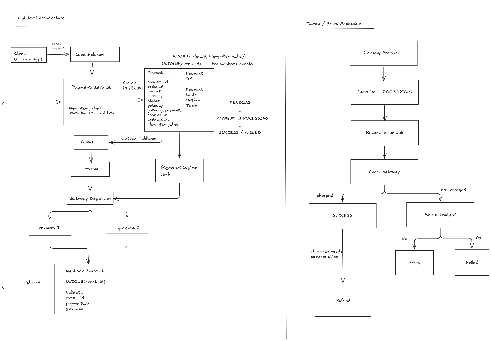

# Design a Payment System

The system should allow customers to pay for an order using supported payment methods and should reliably handle payment success, failure, retries, and duplicate requests.

## 1. Clarification Questions

1. How many payment requests at a time?
   - Normal: 100 requests/sec
   - Peak: 1,000 requests/sec

2. Are we integrating with a single payment gateway or multiple gateways?
   - Multiple gateways
   - More providers may be added in the future

3. Are we supporting one country or multiple countries?
   - India initially
   - International expansion is out of scope for now

4. Who is the client of our Payment System? Is it an e-commerce application?
   - e-commerce application

5. Can the payment gateway send an asynchronous webhook/callback to our Payment System with the final payment status?
   - Yes, gateways can send asynchronous webhooks/callbacks.

6. Should refunds be part of the system?
   - Yes. E-commerce application can request a refund for a successful payment.
   - Payment System should process the refund through the appropriate gateway and track the refund status.

### 1.1 Functional Requirements

- E-commerce application should be able to initiate a payment for an order.
- System should support multiple payment methods such as UPI, cards, wallets, etc.
- System should ensure idempotency so that retries or duplicate requests do not result in duplicate charges.
- System should handle payment success and failure.
- System should provide the current payment status to the e-commerce application.
- System should support safe payment retries.
- System should support integration with multiple payment gateway providers.
- System should support refunds for successful payments and track refund status.

### 1.2. Non - Functional Requirements

- Payment operations must remain correct under concurrent requests and retries; the same payment must not be charged twice.
- Payment state transitions must be consistent and valid.
- High reliability — payment operations should not lose or duplicate transactions even when failures occur.
- High availability - payment system should be available despite individual component or server failures.
- System should scale to handle peak traffic of 1,000 requests/sec and sudden traffic bursts.
- Payment and transaction data must be protected from unauthorized access and tampering.

## 2. Scale Estimation

### Assumptions

- Normal Request: **100 requests/sec**
- Peak Request:**1,000 requests/sec**
- Peak traffic multiplier: **1000/100 = 10x**
- Peak traffic lasts for **2 hours/day.** (normal traffic- 22 hours/day)
- Each payment record is approximately **1 KB.**

### 2.1 Payment Volume

**Normal daily payment requests:**

```text
100*60*60*22 = 7920000 = 7.92 million/day
```

**Peak traffic:**

```text
1000*60*60*2= 7200000 = 7.2 million/day  
```

**Daily payment volume:**

```text
Normal + Peak = 7.92 + 7.20 = 15.12 million/day
```

**Average daily throughput:**

```text
15.12 million / 86400 = 175 request/sec (average over the whole day.)
```

### 2.2 Storage Estimation

**Average storage per day:**

```text
15.12 million * 1KB = 15.12 GB/day
```

**Raw storage per year:**

```text
15.12 * 365 = 5518.8 GB ~ 5.5 TB/year
```

## 3. API Design

### 3.1 Payment Request API

**POST**`/payments`

**Request**:

```json
{
   "order_id": "O-123", 
   "idempotency_key": "key-1",
   "amount": 500.00,
   "currency":"INR",
   "payment_method": "UPI",
   "user_id": "U-123",
   "payment_details": {"UPI Id" : "user2UPI"}  
}
```

**Response**:
HTTP 202 Accepted

```json
{
   "payment_id": "P-123",
   "payment_status": "PENDING"
}
```

### 3.2 Payment Response API

**GET**`/payments/{payment_id}`

```text
200 OK   → payment exists; inspect payment_status
404      → payment doesn't exist
```

```json
{
   "payment_id": "P-123",
   "payment_status": "PENDING"
}
```

### 3.3 Gateway Webhook / Callback API

**Request**:
**POST** `/payments/{gateway_id}/webhook`

```json
{
   "payment_id": "P-123",
   "gateway_transaction_id": "GW-12345",
   "event_id": "E-143",
   "signature": "...",
   "payment_status": "SUCCESS"
}
```

```text
signature → verifies the webhook came from the expected gateway and the payload was not tampered with.
event_id  → identifies the webhook event and helps prevent duplicate processing.
```

**Response:**

HTTP 200 OK

## 4. Data modelling

**Payment:**

```text
   - payment_id     (PRIMARY)
   - payment_method
   - payment_status
   - user_id
   - order_id
   - amount
   - payment_details
   - currency
   - payment_provider
   - gateway_transaction_id
   - idempotency_key   
   - created_at
   - updated_at

UNIQUE(order_id, idempotency_key)
```

**Webhook Event:**

```text
   - event_id          UNIQUE
   - payment_id
   - status
   - received_at
```

**Refund:**

```text
- refund_id          (PRIMARY)
- payment_id
- amount
- refund_status
- gateway_refund_id
- idempotency_key
- created_at
- updated_at

UNIQUE(payment_id, idempotency_key)
```

## 5. High level architecture



## 6. Deep Dives

### 6.1 Payment Creation + Idempotency

- When the customer clicks **Pay**, the e-commerce app sends the payment request to the Load Balancer, which forwards it to the Payment Service.
- The `idempotency_key` identifies a unique payment operation for an order.
- Payment Service creates the payment record with `PENDING` status.
- To prevent duplicate payment creation, we use:
  - `UNIQUE(order_id, idempotency_key)`
- If the same `(order_id, idempotency_key)` already exists, return the existing payment instead of creating a new one.
- The unique constraint also handles concurrent duplicate requests:
  - If two identical requests arrive at the same time, the DB allows only one row to be created.
  - The other request gets a unique-constraint conflict and can fetch the existing payment.

### 6.2 Payment State Transition Validation

The payment state machine is:

PENDING -> PAYMENT_PROCESSING -> SUCCESS / FAILED

- Not all state transitions should be allowed.
- Valid transitions include:
  - `PENDING -> PAYMENT_PROCESSING`
  - `PAYMENT_PROCESSING -> SUCCESS`
  - `PAYMENT_PROCESSING -> FAILED`
- Invalid transitions such as `SUCCESS -> FAILED` should not be allowed.
- Payment Service validates the current state before updating the payment status.
- State updates should be atomic, for example using:
  - `UPDATE ... WHERE payment_id = ? AND status = expected_status`
  - Verify that exactly one row was updated.
- This prevents concurrent workers from applying an invalid or duplicate state transition.

### 6.3 Outbox Pattern

- After the Payment Service creates the `PENDING` payment record, it needs to publish the payment event to the queue.
- If the Payment Service crashes between the DB update and queue publishing, the payment record could exist in the DB but the corresponding queue message could be lost.
- To avoid this, we maintain an **Outbox Table** along with the Payment Table.
- The payment record and outbox event are written in the **same DB transaction**:
  - If the transaction succeeds, both are persisted.
  - If the transaction fails, both are rolled back.
- The **Outbox Publisher** reads pending events from the outbox table and publishes them to the queue.
- If publishing fails, the outbox event remains in the table and can be retried later.

### 6.4 Queue + Worker + Gateway Dispatcher

- Payment processing requests are published to the queue.
- Workers consume messages from the queue and send the payment request to the Gateway Dispatcher.
- The queue generally provides **at-least-once delivery**, so the same message can potentially be delivered more than once. Payment processing should therefore be idempotent.
- The Gateway Dispatcher decides which payment gateway to use based on:
  - Gateway health
  - Configured routing rules
  - Availability
  - Payment method support
  - Cost
- It can route the payment to gateways such as **Razorpay** or **Stripe**.
- If the selected gateway is unavailable, the dispatcher can use a configured fallback gateway.

### 6.5 Retry Mechanism

- During a gateway failure, timeout, or crash, the payment may have been charged or may not have been charged.
- For retryable failures where the payment is known not to have been charged, we can retry using:
  - Maximum attempt limits
  - Exponential backoff
- If all retry attempts are exhausted, the payment can be marked as `FAILED`.
- For timeout or unknown outcomes, we should **not immediately retry the payment**, because the original request may have succeeded at the gateway.
- In such cases, we use:
  - Gateway idempotency
  - Reconciliation
  - Gateway status checks
- This prevents accidentally charging the customer twice.
- `UNIQUE(event_id)` prevents duplicate processing of the same webhook event; it is not the mechanism for preventing duplicate payment charges.

### 6.6 Reconciliation Job

- Suppose the Payment Service crashes or a webhook is missed while the payment is still in `PAYMENT_PROCESSING`.
- At this point, we do not know whether the gateway actually processed the payment.
- The Reconciliation Job identifies payments stuck in an intermediate state and asks the gateway for the actual payment status.
- Based on the gateway response, the Payment Service updates the payment to the appropriate final state such as `SUCCESS` or `FAILED`.
- If the payment is still unresolved, reconciliation can retry the status check later.
- Reconciliation primarily uses the gateway status API to determine the actual payment outcome.
- Gateway idempotency is used if the original payment request itself needs to be safely retried.

### 6.7 Webhook Processing

- The payment gateway sends a webhook event back to the Payment Service after the payment is processed.
- The Payment Service validates the webhook and updates the payment status to `SUCCESS` or `FAILED`.
- To prevent duplicate webhook processing, we use:
  - `UNIQUE(event_id)`
- If the same webhook is delivered multiple times, including concurrently, only one event is processed as new.
- The Payment Service also validates the payment state transition before updating the payment status.

### 6.8 Payment Database Design

The Payment entity contains the information required to track the payment lifecycle and correlate it with the gateway.

Important fields include:

- `payment_id`
- `order_id`
- `idempotency_key`
- `amount`
- `status`
- `gateway`
- `gateway_payment_id` / `gateway_transaction_id`
- `created_at`
- `updated_at`

Important constraints:

- `UNIQUE(order_id, idempotency_key)`
  - Prevents duplicate payment creation for the same request.
- `UNIQUE(event_id)`
  - Prevents duplicate webhook event processing.
- `status`
  - Represents the payment state machine and is validated during state transitions.
- `gateway_payment_id` / `gateway_transaction_id`
  - Correlates our payment with the payment created at the gateway.

We also maintain an **Outbox Table** to reliably publish payment events to the queue.

### 6.9 Webhook Security + Validation

- Webhooks come from external payment gateways, so the Payment Service should not blindly trust the incoming request.
- Validate the webhook signature using the gateway's webhook secret.
- Verify that the webhook belongs to the expected payment using the `gateway_payment_id` / `payment_id`.
- Use `event_id` for idempotency so the same webhook event is not processed multiple times.
- Validate the payment state transition before updating the payment status.
- Only after all validations succeed should the Payment Service update the payment state.

### 6.10 Refund Processing

- E-commerce application can request a refund for an eligible successful payment.
- Create a separate `refund_id` to track the refund independently from the payment.
- Refund state can be:

`PENDING -> REFUND_PROCESSING -> SUCCESS / FAILED`

- Use idempotency for refund requests to prevent duplicate refunds.
- Store `gateway_refund_id` to correlate our refund with the gateway.
- Send the refund request to the appropriate gateway through the Gateway Dispatcher.
- Gateway webhook/status API is used to update the refund status.
- If the refund remains in `REFUND_PROCESSING`, reconciliation can query the gateway for the actual refund status.
- Validate that the refund amount does not exceed the refundable payment amount.

## 7. Bottlenecks and Trade-offs

### 7.1 Payment Service — High Traffic

- If payment traffic increases significantly, the Payment Service can become CPU/memory constrained.
- Use a Load Balancer to distribute traffic across multiple Payment Service instances.
- Horizontally scale the Payment Service based on traffic and resource utilization.
- Use rate limiting to protect the system from sudden traffic spikes.
- Rate limiting protects downstream services but does not increase system capacity.

### 7.2 Payment Database Bottleneck

- Monitor DB CPU, memory, disk I/O, query latency, lock contention, connection pool saturation, and write throughput to identify whether the DB is actually the bottleneck.
- Before sharding:
  - Reduce unnecessary writes.
  - Keep transactions short and efficient.
  - Avoid holding DB transactions while calling external gateways.
  - Optimize queries and use appropriate indexes.
- Scale the DB vertically if appropriate.
- Use read replicas for read-heavy payment-status queries.
- Read replicas do not solve the primary DB's write bottleneck.
- Consider partitioning/sharding only when the write/data volume exceeds the capacity of a single DB and the additional complexity is justified.

### 7.3 Queue Bottleneck

- Monitor:
  - Queue depth/backlog
  - Consumer lag
  - Message age
  - Producer vs consumer throughput
  - Worker utilization
- If producers consistently produce faster than consumers can process, the queue backlog increases.
- Increase the number of workers to process messages concurrently.
- Partition the queue to scale consumer processing horizontally.
- Use `payment_id` as the partition key so events for the same payment are routed to the same partition, helping preserve ordering.
- Different payments can be processed concurrently across different partitions.
- Validate payment state transitions in the DB even when queue ordering is used because messages can be retried or delivered more than once.
- Partition count limits consumer parallelism; having more workers than partitions can leave some workers idle.
- Monitor partition-level lag for hot partitions.

### 7.4 Gateway Failure

- Monitor gateway-specific:
  - Error rate
  - Timeout rate
  - Latency
  - Success rate
  - Logs/traces
- Use a circuit breaker to prevent continuous requests to an unhealthy gateway.
- Circuit breaker states:
  - `CLOSED` → normal traffic
  - `OPEN` → stop sending traffic
  - `HALF_OPEN` → allow limited test requests after a cooldown
- If the gateway becomes healthy, close the circuit and resume normal traffic.
- Route eligible requests to another healthy gateway when possible.

**Important payment-specific consideration:**

- A timeout does not necessarily mean the payment failed.
- The gateway may have charged the customer even though the response was lost.
- Therefore:
  - Known not charged → retry/failover can be considered.
  - Unknown outcome → use gateway status checks/reconciliation and idempotency before retrying.
  - Known successful → do not initiate another charge.

### 7.5 Multiple Gateway Trade-offs

**Advantages:**

- Higher availability if one gateway becomes unavailable.
- Support for different payment methods/capabilities.
- Ability to distribute traffic.
- Potential cost optimization through routing.

**Disadvantages:**

- More integration complexity because gateways have different APIs, error codes, webhook formats, and idempotency mechanisms.
- More complex failure handling and failover.
- More operational work for monitoring, reconciliation, credentials, and provider configuration.
- Additional provider/contract management complexity.

The Gateway Dispatcher/adapter layer isolates provider-specific logic from the core Payment Service.

## 8. Reliability

### 8.1 Payment Service Crash

- If the Payment Service crashes after committing the payment but before publishing the event:
  - Use the **Outbox Pattern**.
  - Payment and outbox event are committed in the same DB transaction.
  - The Outbox Publisher publishes the event after the service recovers.

- If the worker crashes after sending the payment request to the gateway but before receiving the response:
  - The payment outcome is unknown.
  - Do not blindly send another charge request.
  - Use the gateway's idempotency mechanism and/or gateway status API.
  - Reconciliation can resolve the final payment status.

- If the Payment Service crashes after receiving a successful gateway response but before updating the DB:
  - Payment may remain `PAYMENT_PROCESSING`.
  - Reconciliation queries the gateway and updates the payment to the correct final state.

- If the client loses the network after sending the payment request but before receiving the response:
  - The client cannot know whether the payment was created.
  - Retry using the **same `idempotency_key`**.
  - If the payment already exists, return the existing `payment_id` and status.
  - Otherwise, safely create the payment.
  - This prevents network retries from creating duplicate payments.

### 8.2 Retry and Idempotency

- Use retries with exponential backoff for retryable failures.
- Use maximum retry attempts to prevent infinite retries.
- Do not blindly retry requests when the gateway outcome is unknown.

Different layers use different idempotency mechanisms:

- **Client → Payment Service**
  - `order_id + idempotency_key`
  - Prevents duplicate payment creation.

- **Queue → Worker**
  - Queue provides at-least-once delivery, so duplicate messages are possible.
  - Payment processing must therefore be idempotent.

- **Payment Service → Gateway**
  - Gateway idempotency key prevents duplicate charges when the same payment request is retried.

- **Gateway → Payment Service**
  - `event_id` with a unique constraint prevents duplicate webhook processing.

- **Unknown gateway outcome**
  - Gateway status lookup + reconciliation determines whether the payment actually succeeded.
  - Gateway idempotency makes retrying the same payment request safe.

### 8.3 Gateway Failure

- Monitor gateway error rate, timeout rate, latency, and success rate.
- Use a circuit breaker:
  - `CLOSED` → normal traffic.
  - `OPEN` → stop sending requests to the unhealthy gateway.
  - `HALF_OPEN` → send limited test requests after a cooldown.
- Route eligible requests to another healthy gateway.
- Do not automatically fail over a timed-out payment because the original gateway may have already charged the customer.

### 8.4 Database Failure

- The Payment DB is the source of truth for payment state.
- Redis should not replace the Payment DB as the source of truth.
- If the DB is temporarily unavailable and the request cannot be durably persisted:
  - Do not accept/acknowledge the payment.
  - Return a temporary failure.
  - The client can retry using the same `idempotency_key`.
- DB reliability can be improved using replication/failover, backups, monitoring, and appropriate scaling.

### 8.5 Core Reliability Principle

> Assume failures and retries can happen at every system boundary. Persist state durably, make operations idempotent, and use reconciliation to resolve unknown external outcomes.

## 9. Observability

- Monitor Payment Service request rate, error rate, p95/p99 latency and DB health.
- Monitor queue depth, message age, consumer lag and worker utilization.
- Monitor gateway success/error/timeout rate and latency per provider.
- Monitor payment success/failure rate, `PAYMENT_PROCESSING` backlog and reconciliation backlog.
- Use structured logs with `payment_id`, `order_id`, `gateway_transaction_id`, retry attempt and error.
- Use distributed tracing to identify whether latency is in the Payment Service, DB, queue, worker, gateway or webhook processing.
- Alerts for abnormal queue growth, gateway failures, high latency, DB issues and payments stuck in intermediate states.

## 10. Security

- Authenticate clients/users before allowing payment or refund operations.
- Authorize access to ensure a client/user can only operate on permitted payments/orders.
- Validate `order_id`, amount, currency, payment method and payment state.
- Do not trust the client-supplied payment amount; verify it against the authoritative order amount.
- Validate webhook signatures and verify `payment_id` / `gateway_transaction_id`.
- Use `event_id` uniqueness + timestamp/expiry validation to protect against webhook replay.
- Do not store sensitive payment credentials such as CVV, full card number or UPI PIN.
- Use tokenized payment references where supported by the gateway.
- Use TLS for data in transit and encryption for sensitive data at rest.
- Store gateway credentials/secrets securely using a secrets manager.
- Apply rate limiting and quotas to protect payment/refund APIs from abuse.
- Use retry limits, exponential backoff and timeouts to prevent retry storms.
- Maintain audit logs for important payment and refund operations.
