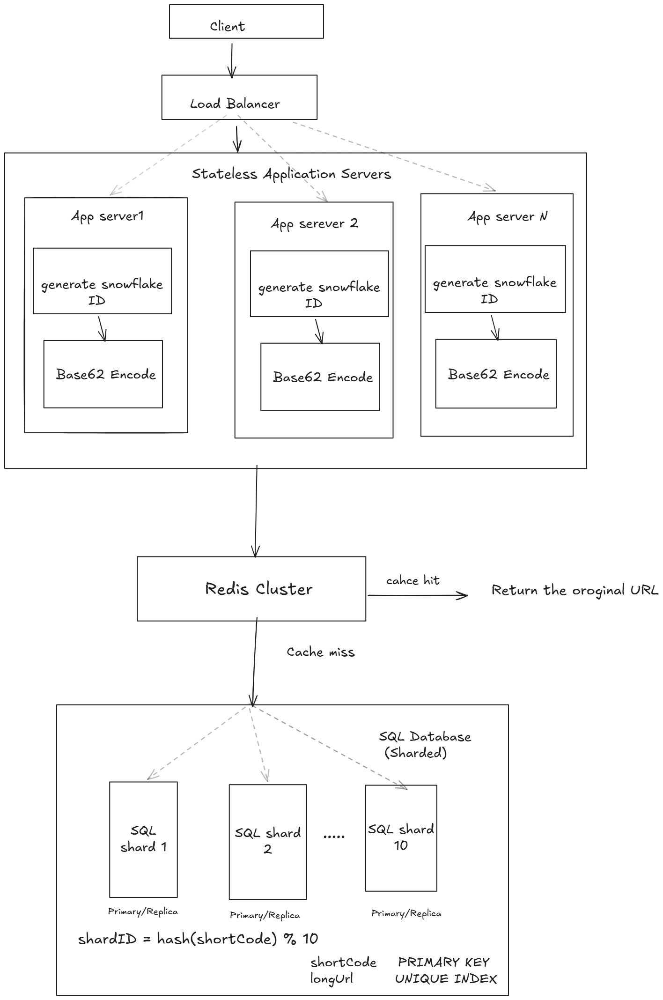

# Design a URL shortener

Design a URL shortening service like Bitly. A user provides a long URL, and the system returns a short URL. When someone visits the short URL, they should be redirected to the original URL.

## 1. Clarification Questions / Assumptions
- 100M short URLs created/day
- Each short URL is accessed ~10 times/day
- Peak traffic = 5× average traffic
- URLs retained for 5 years
- Average URL mapping size ≈ 500 bytes
- Average redirect traffic ≈ 1 KB/request

### Functional Requirements:
- User can create a short URL from a long URL.
- User can access a short URL.
- System redirects the user to the original URL.

### Non Functional Requirements:
- High availability
- Low latency for redirects
- High reliability
- Durable storage
- Support the expected scale (100M URLs/day)
- URLs retained for 5 years

## 2. Scale Estimation

### Redirect Traffic

100M URLs/day * 10 accesses/day = 1 billion redirects/day

Average redirect QPS:
```text
1000000000/86400 ≈ 11574 ≈ 11.6K QPS
```

Peak redirect traffic (5×):
```text
 11,574 × 5 = 57870 ≈ 58K QPS
```

### URL Creation Traffic
100M URL creations/day 

Average creation QPS:
```text
100,000000/86400 ≈  1,157 QPS = 1.157K ≈ 1.16K QPS
```

Peak creation QPS (5×)
```text
1157*5=5785 ≈ 5.8K QPS
```

#### This is a read-heavy system.

### Storage:
Total URL mappings over 5 years:
```text
100M * 365 * 5 (retain for 5 years) = 182500000000 ~ 182.5 billion URL mappings over 5 years
```

Daily storage:
Assume ~500 bytes per URL mapping.
```text
100M × 500 bytes = 50000000000 = 50GB
```

5-year storage  
```text
182.5B x 500 bytes = 91250 ≈ 91.25 TB
```

### Redirect bandwidth:
Assuming ~1 KB of traffic per redirect:
```text
11574*1KB = 11574KB ≈ 11.6MB/sec
```

## 3. API design
### Create Short URL

**POST** `/shorten`

**Request:**

```json
{
  "longUrl": "https://example.com/abc"
}
```

**Response:**
```json
{
  "shortCode": "aB7xK2",
  "shortUrl": "https://short.ly/aB7xK2"
}
```
### Redirect
**GET** `/{shortCode}`

**Response:**
```http
302 Found
location:  https://example.com/abc
```

### API considerations
- Validate longUrl → 400 Bad Request
- Same long URL submitted again → return existing mapping
- Same request retried after network failure → operation should be idempotent

## 4. Data Model

```text
URLMapping
-------------------------
shortCode    PRIMARY KEY
longUrl      UNIQUE INDEX
createdAt
expiredAt
```

Access patterns:
```text
shortCode → longUrl       // redirect
longUrl   → shortCode     // duplicate creation
```

## 5. High-Level Architecture

### Architecture Diagram



### Load Balancer:
- Distributes traffic across application servers.
- Uses health checks to detect unhealthy servers.
- Stops routing traffic to failed servers.

### Short Code Generation

- Generate a globally unique numeric ID.
- Use a Snowflake-style ID generator for distributed unique IDs.
- Encode the ID using Base62.
- Unique ID → uniqueness
- Base62 → compact shortCode

## 6. Deep Dives
### 6.1 Database Sharding

The SQL database is sharded because the total data volume is very large.

- Use `shortCode` as the shard key.
- Use hash-based sharding.
- Assume 10 database shards.

Shard routing:

```text
shardId = hash(shortCode) % numberOfShards

Example: hash("aB7xK2") % 10 → Shard 7
```

### 6.2 Shard capacity

As data grows, an individual shard can become too large.

- Total storage ~ 91.25TB over 5 years
- Across 10 shards, average data ≈ 9.1 TB/shard
- A shard may eventually approach its storage/capacity limit.

Problem:
- How do we add more capacity without taking the system down?

### 6.3 Horizontal Scaling / Resharding

If existing shards approach their capacity, we can horizontally scale by adding more database shards.

Challenge:
- With `hash(shortCode) % N`, changing N changes the shard mapping.
- Existing data may need to be moved to new shards.
- This is called resharding.

### 6.4 Redis Caching

Redis is used to reduce redirect latency and database read load.

Redirect flow:

1. Application receives `GET /{shortCode}`.
2. Check Redis using `shortCode` as the cache key.
3. If cache hit → return the original URL.
4. If cache miss → query the appropriate SQL shard.
5. Store the result in Redis.
6. Return the original URL.

Benefits:
- Lower redirect latency.
- Reduces SQL database read traffic.
- Helps handle high read QPS.

#### Cache Stampede

If a popular key is missing from Redis, many concurrent requests may all query the database for the same key.

Example:
```
Redis MISS
    ↓
Request 1 → DB
Request 2 → DB
Request 3 → DB
...
```
This can cause:
- Sudden database load
- Increased latency
- Potential database overload

#### This is called a cache stampede / thundering herd.

#### Stale Cache

Redis may contain old data after the corresponding database record has been updated, deleted, or expired.

Example:

```text
SQL:
aB7xK2 → deleted

Redis:
aB7xK2 → https://example.com/abc
```
If the application reads Redis, it may return stale data.

Problem:
- Cache and database can temporarily become inconsistent.

### 6.5 Application Server Scaling

If a single application server cannot handle peak traffic:

- Add multiple application servers.
- Load Balancer distributes requests across them.
- Application servers remain stateless so any server can handle a request.

This allows horizontal scaling of the application tier.

#### Stateless Application Servers

Application servers should not keep important shared state in local memory. Any request should be able to go to any application server.

Benefits:
- Easy horizontal scaling.
- Load Balancer can distribute requests freely.
- If one application server fails, another can handle the request.
- Avoids dependency on sticky sessions.

Shared state should be stored in systems such as Redis or the database.

## 7. Bottlenecks & Trade-offs 

### Redis Bottleneck

Problem:
- Redirect traffic can reach ~58K QPS at peak.
- A single Redis instance may eventually become a bottleneck.

Solution:
- Horizontally scale Redis using multiple nodes.
- Distribute cache keys across Redis nodes.

Benefit:
- Higher cache throughput.
- Avoids dependence on a single Redis node.

Trade-off:
- Distributed cache is more complex than a single Redis instance.

### SQL Shard Bottleneck

Problem:
- A shard can become overloaded with read/write traffic.
- This can increase latency and cause timeouts/failures.

Possible solution:
- Horizontally scale by adding more shards.
- Redis reduces most redirect reads, so the database primarily handles
  cache misses and URL creation.

Trade-off:
- More shards increase operational and routing complexity.
- Adding shards may require resharding existing data.

### Database Workload

Because redirects are read-heavy and Redis handles cache hits:

- Most redirect requests are served by Redis.
- SQL primarily handles:
  - URL creation writes (`POST /shorten`)
  - Redirect reads on Redis cache misses.

## 8. Reliability

### 8.1 Application Server Failure

If an application server crashes:

- Load Balancer detects the unhealthy instance through health checks.
- Stops routing new requests to that server.
- Routes requests to healthy application servers.
- Stateless design allows any healthy server to handle the request.

Result:
- No single application server is a single point of failure.
- The application tier remains highly available as long as enough healthy instances remain.

### 8.2 Redis Failure

If Redis is unavailable:

- Application falls back to SQL.
- However, all redirect traffic may reach SQL.
- At peak traffic this could be ~58K QPS.
- This can overload the SQL database and increase latency.

Therefore:
- Redis failure should be detected quickly.
- SQL fallback provides availability, but may not sustain full peak traffic.
- Redis should be deployed with multiple nodes to avoid a single Redis node failure taking down the entire cache layer.

### 8.3 SQL Shard Failure

Each SQL shard should have replication.
Replication → fault tolerance / high availability

Example:
```text
Shard 3
   ├── Primary
   └── Replica
```
If the primary fails:
- Detect the failure.
- Promote the replica.
- Route requests to the new primary.

Benefits:
- Avoids a single database server being a single point of failure.
- Improves availability and durability.

Trade-off:
- Replication adds infrastructure and operational complexity.

### 8.4 Idempotency

Problem:
```text
Client → POST /shorten
              ↓
        SQL write succeeds
              ↓
        Response is lost
              ↓
        Client retries the request
```

Without idempotency:
- The same operation may create multiple short URLs.

Solution:
- Use an idempotency key for the create request.
- If the same request is retried, return the result of the original operation instead of creating another mapping.

Benefit:
- Safe retries.
- Prevents duplicate operations.

### Key Reliability Principles

- Stateless application servers → easy failover and horizontal scaling.
- Replication → fault tolerance for database failures.
- Redis fallback → availability during cache failure, but can overload SQL.
- Idempotency → safe retries without duplicate operations.
